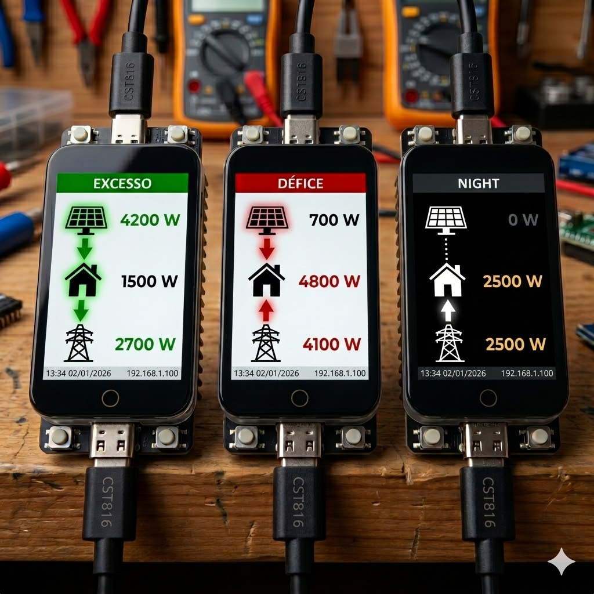
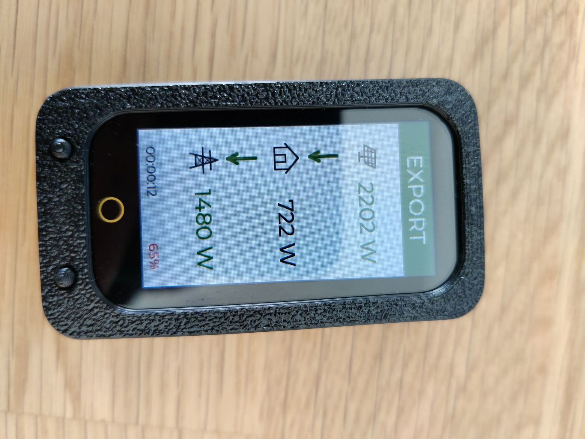
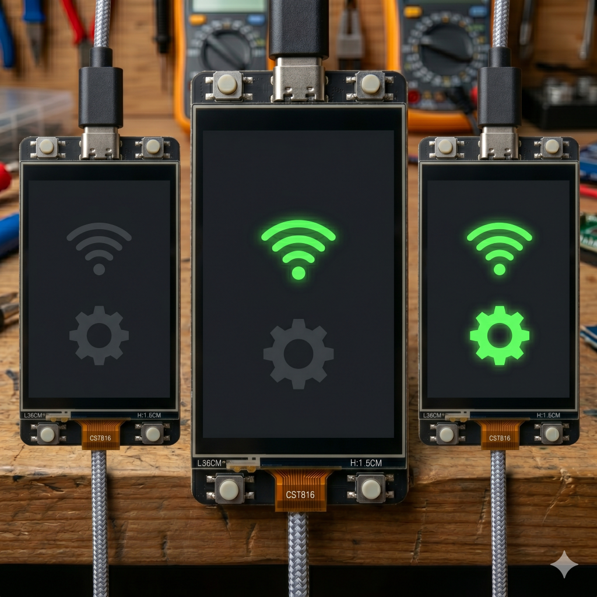
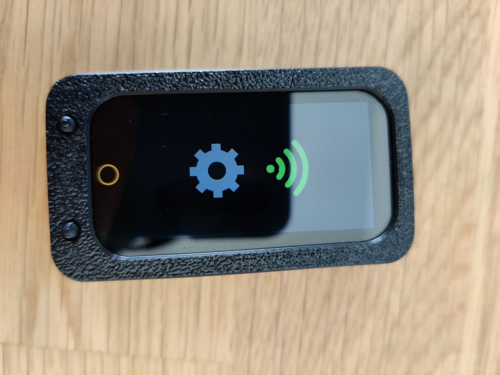
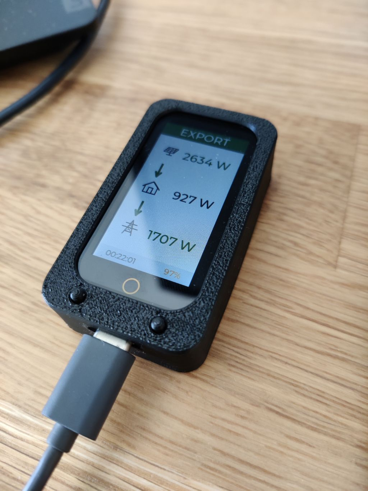

Here is the updated **en-US** `README.md` file for your GitHub repository. I have updated the "Project Showcase" section to use the `_small.jpg` version of the final photo while maintaining the side-by-side layout for the Startup sequence and the specific hardware photo you requested previously.

***

# Huawei Inverter Monitor (LilyGO T-Display-S3)

This project is a dedicated hardware monitoring solution for **Huawei SUN2000** solar inverters, powered by the **LilyGO T-Display-S3**. It provides real-time visualization of photovoltaic production, household consumption, and grid energy flow through a dynamic Human-Machine Interface (HMI) built with the **LVGL** library.

---

## 📸 Project Showcase

A comparison between the initial design concept and the fully functional hardware implementation.

| **Design Concept (Mockup)** | **Final Build (Hardware)** |
| :---: | :---: |
|  |  |

---

## ✨ Key Features

*   **Reactive Monitoring:** 3-second polling cycle displaying values in absolute **Watts** for instant awareness of household load changes.
*   **Advanced HMI:** High-performance interface using the **LVGL** library with dynamic icons and adaptive color logic.
*   **Intelligent Night Mode:** The UI automatically switches to a **"NIGHT"** (Dark Mode) state whenever solar production drops to **0W** [25, Conversation History].
*   **Power Management:** Native support for **Deep Sleep**, real-time battery voltage/percentage monitoring, and USB charging detection.
*   **Physical Interaction:** Onboard buttons (**IO0** and **IO14**) are mapped for manual brightness control and system navigation.

---

## 🖼️ User Interface (UI)

The UI is divided into two main stages to ensure a polished user experience:

### Startup (Splash Screen)
Upon boot, the device displays a splash screen that tracks the initialization of the Wi-Fi connection and the Modbus synchronization with the inverter.

| **Splash Concept (Mockup)** | **Splash Real (Hardware)** |
| :---: | :---: |
|  |  |

### Main Dashboard
Displays the energy flow between the Solar Panels, the House, and the Utility Grid. The header adapts dynamically based on energy metrics:
*   **EXPORTING (Green):** Active when production exceeds household consumption.
*   **IMPORTING (Red):** Active when the house is drawing power from the grid.
*   **NIGHT (Dark):** Active during zero production states [25, Conversation History].

---

## 🛠️ Hardware & Enclosure

The system is optimized for the **LilyGO T-Display-S3**, featuring a custom physical protection solution.

*   **Microcontroller:** ESP32-S3R8 Dual-core with **8MB of PSRAM** (mandatory for high-res LVGL buffers).
*   **Display:** 1.9" IPS LCD (170x320 px) with an 8-bit parallel interface.
*   **Enclosure:** Custom **3D-printed case** specifically designed for the T-Display-S3 to provide protection and a professional finish [Conversation History].

>   
> *Detailed view of the hardware inside its custom 3D-printed enclosure.*

---

## 🚀 Setup & Installation

### Arduino IDE Settings
To compile the project, install the **ESP32 by Espressif Systems** package and use the following settings:
*   **Board:** `ESP32S3 Dev Module`
*   **PSRAM:** `OPI PSRAM` (**Required**)
*   **Flash Size:** `16MB`
*   **Partition Scheme:** `16M Flash (3MB APP/9.9MB FATFS)`

### Connectivity
The device connects **directly** to the inverter's internal Access Point (AP) to bypass firmware restrictions (SPC155):
*   **Inverter IP:** `192.168.200.*`
*   **Port:** `660*`
*   **SSID:** `SUN2000-[Your Serial Number]`

---

## 📂 Software Architecture

The code is organized into a modular **C++** structure for better maintenance:
*   `Models.h`: Data structures and Modbus register mapping.
*   `HuaweiReader.h`: Logic for Modbus TCP communication.
*   `Ui.h`: LVGL screen management and dynamic visual states.
*   `SplashScreen.h`: Boot sequence and asset initialization.

---

## ⚠️ Disclaimer

This project is a community-developed tool and is **not officially affiliated with Huawei**. Use Modbus communications responsibly to ensure no interference with critical inverter operations.
